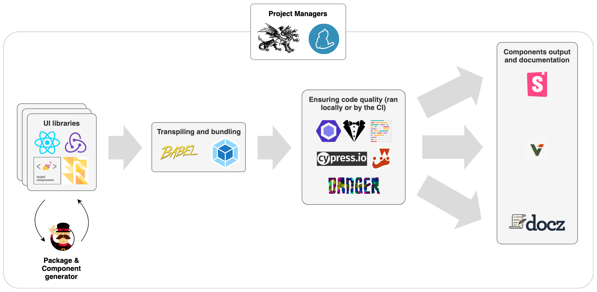
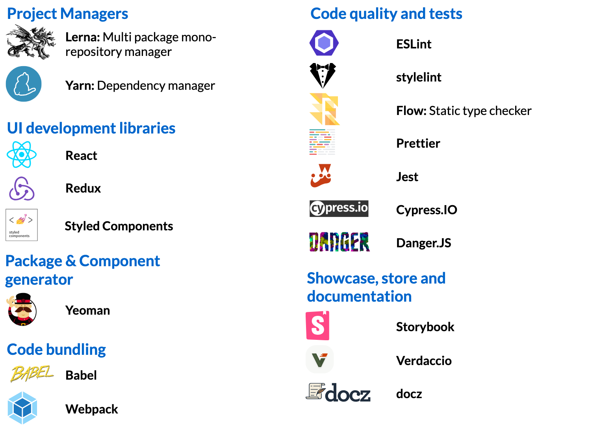

# Shared components ⚙️

**Discover how we organised our project of shared React components!**

> In this repository you will find a working example of a mono-repo of React components libraries.
> 
> "Shared components" purpose is to share any size of components between apps.
> 
> We want to give enough tips to reassure you in making a similar choice for your company, if needs be.

*You can copy paste and reuse this project as is, if you'd like*

## Key learnings!

### **1. Have a mono-repository**
Split your responsibilities and domains in different packages, but have them all in one place for a smoother developer experience.

### **2. Design your components following "Atomic Design"**
An atom is a very small dumb and highly reusable component, while an organism is a full grown one-page business connected feature.

### **3. Centralise your components in one Showroom: Storybook**
We use Storybook to develop and showcase our components! One central and unbiased place, forcing to thing reusability.

### **4. Beware breaking changes**
Use automatic versionning, changelogs and type systems to prevent messy bugs because of not anticipated breaking changes.

### **5. Define your customisation strategy**
We used Styled Components themes and an additionnal service of ours to define how our components can be customised.

### **6. Make your packages light**
With Tree Shaking, your users will just bundle what they need.

### **7. Control what components or features might enter your project**
Developing on "Shared components" is heavier than on a normal project, hence taking the decision to create a new component should be well thought. We recommend to plan at least 3 reuses of the component to make it worthwile.

### **8. Our feature branch Git flow**
All feature branches start from Master. PRs are first merged on Develop. Then on Master.
Every time, we merge Master in Develop to keep them aligned.

### **9. Regularly update your dependencies**
More than any other project, "Shared components" has to be aligned with the latest standards, as new projects might launch and need to be compatible with it.

### **10. Dedicate a core team**
Just as an open source project, have a dedicated tech/business team focused on making "Shared components" a success

### **11. Ease the Yarn Link pain**
If you want to locally test your component on your host project, you'll have to use "Yarn Link", we learned how to compose with it.

## Our stack
*Lerna, React, Storybook, ...*

## Contributors

*TBD*
